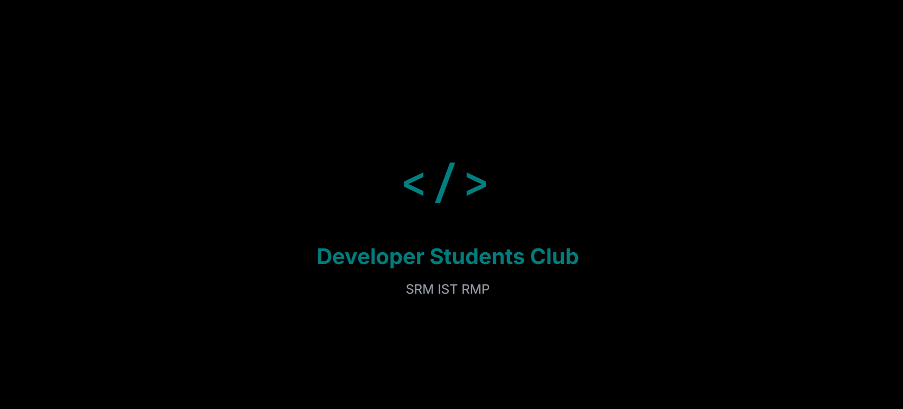

# Developer Students Club - SRM IST RMP

A modern, mobile-responsive web application for the Developer Students Club at SRM Institute of Science and Technology, Ramapuram Campus.

## 🌟 Features

### 🎨 **Beautiful Splash Screen**
- Animated teal `</>` symbol with fade-in effects
- Professional branding with club name and institute details
- Smooth transition to main application

### 🏠 **Landing Page**
- Clean, modern hero section
- Interactive call-to-action buttons
- Responsive navigation system

### ℹ️ **About Us Section**
- Three informative cards showcasing:
  - Club mission and vision
  - Activities and workshops
  - Community and joining information

### 👥 **Team Management System**
- **Add Members**: Complete form with name, role, photo, and description
- **View Members**: Beautiful card layout with member information
- **Edit Members**: Update member details in-place
- **Delete Members**: Remove team members with confirmation
- **Photo Support**: Display member photos or placeholder avatars

## 🚀 Technical Stack

- **Frontend**: React.js with modern hooks and state management
- **Backend**: FastAPI with Python
- **Database**: MongoDB with PyMongo
- **UI Components**: shadcn/ui component library
- **Styling**: Custom CSS with CSS variables and responsive design
- **Typography**: Inter font family for modern aesthetics

## 🎨 Design Features

- **Teal Accent Color** (#008080) for consistent branding
- **Mobile-First** responsive design
- **Smooth Animations** and hover effects
- **Modern Typography** with proper spacing and hierarchy
- **Accessible** with proper contrast and keyboard navigation

## 📦 Installation & Setup

### Prerequisites
- Node.js (v16 or higher)
- Python (v3.8 or higher)
- MongoDB (v4.4 or higher)
- Yarn package manager

### Backend Setup

1. **Navigate to backend directory:**
   ```bash
   cd backend
   ```

2. **Install Python dependencies:**
   ```bash
   pip install -r requirements.txt
   ```

3. **Set up environment variables:**
   Create a `.env` file in the backend directory:
   ```env
   MONGO_URL=mongodb://localhost:27017
   DB_NAME=dsc_club
   CORS_ORIGINS=*
   ```

4. **Start the backend server:**
   ```bash
   python server.py
   ```
   The API will be available at `http://localhost:8001`

### Frontend Setup

1. **Navigate to frontend directory:**
   ```bash
   cd frontend
   ```

2. **Install dependencies:**
   ```bash
   yarn install
   ```

3. **Set up environment variables:**
   Create a `.env` file in the frontend directory:
   ```env
   REACT_APP_BACKEND_URL=http://localhost:8001
   ```

4. **Start the development server:**
   ```bash
   yarn start
   ```
   The application will be available at `http://localhost:3000`

## 🔌 API Endpoints

### Team Members
- `GET /api/team-members` - Get all team members
- `POST /api/team-members` - Create a new team member
- `GET /api/team-members/{id}` - Get a specific team member
- `PUT /api/team-members/{id}` - Update a team member
- `DELETE /api/team-members/{id}` - Delete a team member

### Club Information
- `GET /api/club-info` - Get club information and activities
- `GET /api/health` - Health check endpoint

### Example API Usage

**Create a team member:**
```bash
curl -X POST "http://localhost:8001/api/team-members" \
     -H "Content-Type: application/json" \
     -d '{
       "name": "John Doe",
       "role": "Frontend Developer",
       "photo": "https://example.com/photo.jpg",
       "description": "Passionate about React and modern web development"
     }'
```

**Get all team members:**
```bash
curl -X GET "http://localhost:8001/api/team-members"
```

## 📱 Responsive Design

The application is fully responsive and works seamlessly across:
- **Desktop** (1200px+)
- **Tablet** (768px - 1199px)
- **Mobile** (320px - 767px)

### Mobile Features
- Simplified navigation with icons
- Optimized touch targets
- Stacked layouts for better readability
- Responsive images and content

## 📸 Screenshots  

Here are some previews of the project:

  
  
  
  
  
  

## 🛠️ Development

### Project Structure
```
/
├── backend/                 # FastAPI backend
│   ├── server.py           # Main API application
│   ├── requirements.txt    # Python dependencies
│   └── .env               # Environment variables
├── frontend/               # React frontend
│   ├── src/
│   │   ├── App.js         # Main React component
│   │   ├── App.css        # Main styles
│   │   ├── index.js       # Entry point
│   │   └── components/    # UI components
│   ├── package.json       # Node dependencies
│   └── .env              # Environment variables
└── README.md             # This file
```

### Adding New Features

1. **Backend**: Add new endpoints in `server.py`
2. **Frontend**: Update `App.js` for new UI components
3. **Database**: Schema is flexible with MongoDB
4. **Styling**: Add styles in `App.css` using existing design system

### Design System

The application uses a consistent design system:
- **Colors**: Defined in CSS variables for easy theming
- **Typography**: Inter font with responsive sizing
- **Spacing**: Based on 4px grid system
- **Components**: Reusable shadcn/ui components

## 🧪 Testing

The application includes comprehensive testing for:
- **API Endpoints**: All CRUD operations tested
- **Frontend Functionality**: Navigation and user interactions
- **Responsive Design**: Multiple viewport sizes
- **Error Handling**: Proper error states and validation

### Running Tests

**Backend API Testing:**
```bash
python backend_test.py
```

**Frontend Testing:**
```bash
cd frontend
yarn test
```

## 🚀 Deployment

### Production Build

1. **Build frontend:**
   ```bash
   cd frontend
   yarn build
   ```

2. **Deploy backend:**
   - Configure production MongoDB URL
   - Set proper CORS origins
   - Use production ASGI server (gunicorn + uvicorn)

3. **Environment Variables:**
   Update production environment variables accordingly.

## 📄 License

This project is created for the Developer Students Club at SRM IST Ramapuram Campus.

## 🤝 Contributing

1. Fork the repository
2. Create a feature branch
3. Make your changes
4. Test thoroughly
5. Submit a pull request
 
## 📞 Support

For support and questions:
- **Club**: Developer Students Club - SRM IST Ramapuram
- **Email**: Contact your club coordinators
- **GitHub**: Create an issue in the repository

---

**Built with ❤️ by Developer Students Club - SRM IST RMP**
